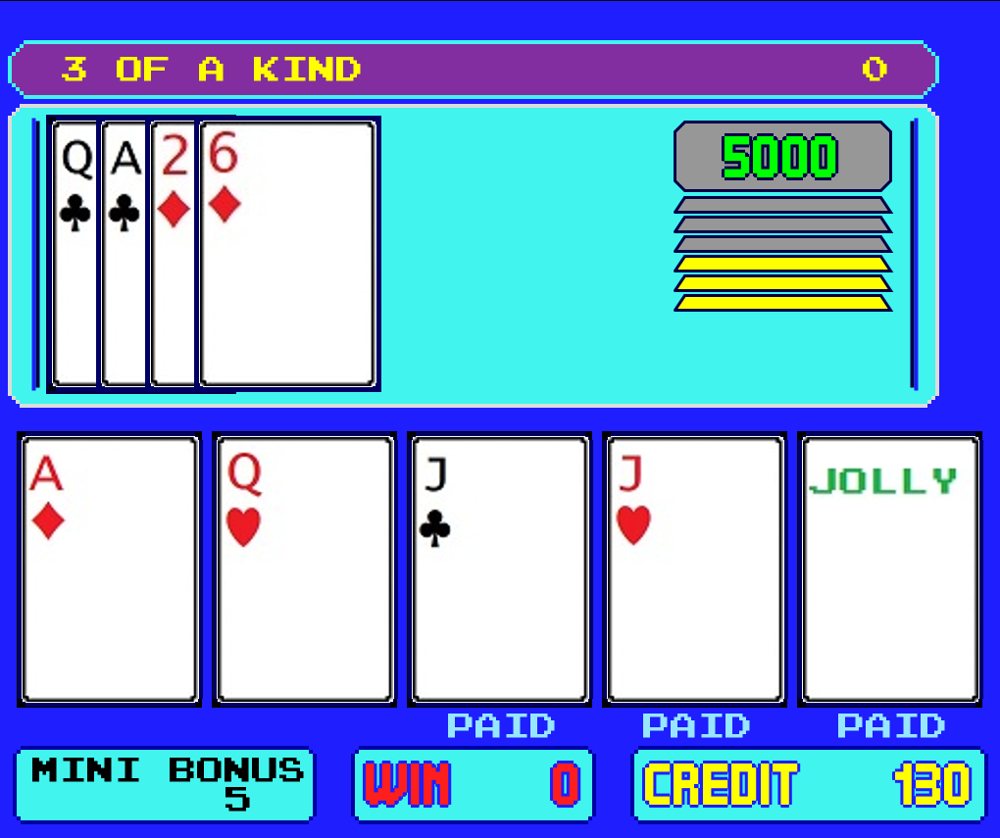

# **American Poker**

This is a fun challenge I took in 2018 when I was playing around with [Processing](https://processing.org/), a fun yet powerful language which I fully recommend for learning how to code. It is aimed at artists, designers and hobbists.

It is a replica of the American Poker II game that was a popular cabinet game from [Novomatic](https://www.novomatic.com/en) in Romania in the 90s.

  

The replica is fully functional, minus the sound and the images for the J, Q, K, A and Jolly Joker cards.

It is written entirely in [Processing 3.3.7](https://processing.org/), while the graphics have been created in the good old Microsoft Paint.

The fonts used are [Press Start 2P](https://fonts.google.com/specimen/Press+Start+2P) for most of the text and [Quadrit](https://www.dafont.com/quadrit.font) for the BET and CREDIT sections.
  

 
 
 
 
 
 
 
